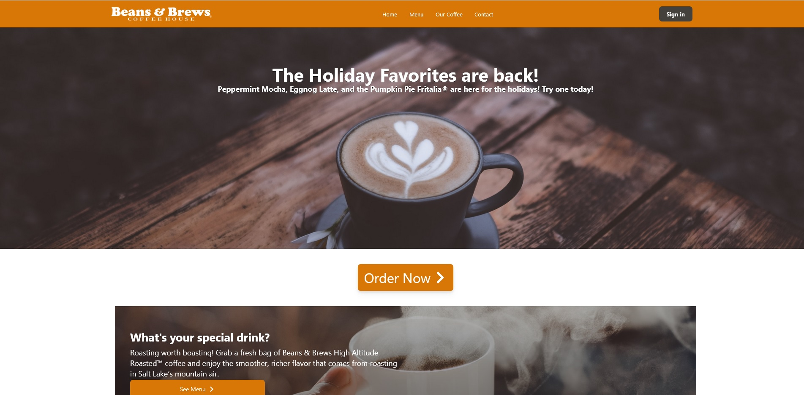
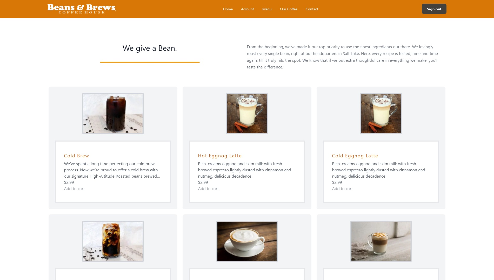
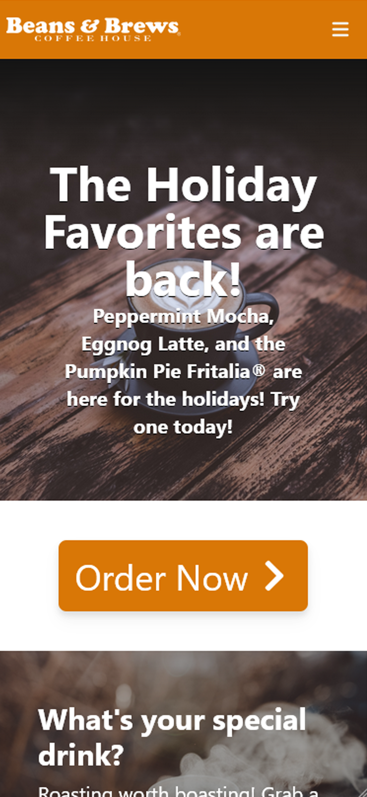

# Beans and Brews Coffee House: Revisited

## Description
This application is a revisitation of the Beans and Brews Coffee House application. Content on the official website distracts users with numerous obstacles creating friction when ordering. Our application eliminates superfluous content and enables users to have a more concise and smoother experience ordering online and interacting on the website.  

## Table of Contents
- [Beans and Brews Coffee House: Revisited](#beans-and-brews-coffee-house-revisited)
  - [Description](#description)
  - [Table of Contents](#table-of-contents)
  - [Features](#features)
  - [Usage](#usage)
  - [Preview](#preview)
    - [Desktop](#desktop)
    - [Mobile](#mobile)
  - [Technologies](#technologies)
  - [Credits](#credits)
  - [Link](#link)

## Features
- Infrastructure for ordering your favorite drinks online.
- Online account creation where you can save your drink preferences, track rewards, and use coupons.
- Automated display settings that match a user's browser's settings. 

## Usage
- After creating an account, users can order drinks and merchandise online using this application.
- Users can browse menu and merchandise and learn more about the company and how Beans and Brews offers a truly unique approach to coffee and roasting.
- Users can manage their settings, points, rewards, and coupons easily on the account page.

## Preview
### Desktop
  
   
  
   

### Mobile
  

## Technologies
- Front-End: JavaScript, HTML5, CSS, ReactJS, TailwindCSS, NodeJS, Redux 
- Back-end: ApolloDB, GraphQL, MongoDB, Express, NodeJS, Bcrypt, JSON Web Token, Mongoose

## Credits
- 
- 
- 
- 
- 

## Link
Deployed Application: https://beans-and-brew.herokuapp.com/

